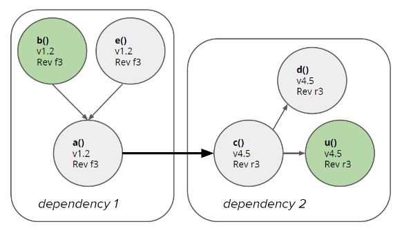
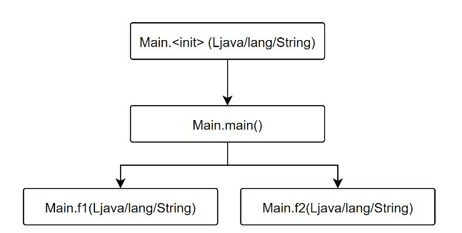

 

  <h1 align="center">End of Degree Project</h1>

  

    Call tree and metrics for code analysis
  

  

    
    

  <h3 align="left">Connect with me:</h3>
    

    
    
    

<!-- TABLE OF CONTENTS -->

  
Table of Contents

  <ol>
    <li>
      <a href="#about-the-project">About The Project</a>
      <ul>
        <li><a href="#built-with">Built With</a></li>
      </ul>
    </li>
    <li>
      <a href="#getting-started">Getting Started</a>
      <ul>
        <li><a href="#prerequisites">Prerequisites</a></li>
        <li><a href="#installation">Installation</a></li>
      </ul>
    </li>
    <li><a href="#usage">Usage</a></li>
    <li><a href="#contributing">Contributing</a></li>
    <li><a href="#license">License</a></li>
    <!--<li><a href="#acknowledgments">Acknowledgments</a></li>-->
  </ol>

<!-- ABOUT THE PROJECT -->
## About The Project

(<a href="#top">back to top</a>)

The project is located within the software quality branch, specifically in software maintenance. A program has been developed to obtain the call tree of a Java project, complementing the tree with method and class metrics. 

First, the source and compiled code of a Java application is analyzed and then the call tree is built and metrics are added to analyze its quality, as requested by the company. The goal of the project was to replace the manual work performed by the company with an automated and error-free process.

In order to carry out this project, a study has been made of the different options available, evaluating each one of them. The anslysis of each project has been very deep, evaluating each of the options and arguing the choice of each one of the tools used. Finally, exhaustive tests have been carried out to verify the correct operation of the program.

  

_For more information, please refer to the [Documentation](Documentation.pdf) (Spanish)_
_Summarized information also included in the poster  [Poster](Poster.pdf) (Spanish)_

### Built With

The technologies used for this project are as follows:

<!-- https://devicon.dev/ -->
  
<!-- AWS -->
<!-- BASH -->     
<!-- DOCKER -->
<!-- KUBERNETS  -->

<!-- JS -->
<!-- Node -->
<!-- EX -->
<!-- TS -->
<!-- React -->
<!-- Mongo -->
<!-- PYTHON -->

<!--  -->
<!--  -->
<!--  -->
<!--  -->

      

(<a href="#top">back to top</a>)

<!-- CONTRIBUTING -->
## Contributing

Project Link: [https://github.com/iakigarci/repo_name](https://github.com/iakigarci/repo_name)

Contributions are what make the open source community such an amazing place to learn, inspire, and create. Any contributions you make are **greatly appreciated**.

If you have a suggestion that would make this better, please fork the repo and create a pull request. You can also simply open an issue with the tag "enhancement".
Don't forget to give the project a star! Thanks again!

1. Fork the Project
2. Create your Feature Branch (`git checkout -b feature/AmazingFeature`)
3. Commit your Changes (`git commit -m 'Add some AmazingFeature'`)
4. Push to the Branch (`git push origin feature/AmazingFeature`)
5. Open a Pull Request

(<a href="#top">back to top</a>)

<!-- LICENSE -->
## License

Distributed under the MIT License. See `LICENSE.txt` for more information.

(<a href="#top">back to top</a>)

<!-- ACKNOWLEDGMENTS -->
<!--
## Acknowledgments
During this project, knowledge has been acquired that will be important for the future. Listed here are the resources that have been used in order to successfully complete this project:

* [Choose an Open Source License](https://choosealicense.com)

(<a href="#top">back to top</a>)

-->
<!-- CONTRIBUTORS -->
<!--
## Contributors
* iakigarci [https://github.com/iakigarci/](https://github.com/iakigarci/)

-->

<!-- MARKDOWN LINKS & IMAGES -->
<!-- https://www.markdownguide.org/basic-syntax/#reference-style-links -->
[contributors-shield]: https://img.shields.io/github/contributors/othneildrew/Best-README-Template.svg?style=for-the-badge
[contributors-url]: https://github.com/othneildrew/Best-README-Template/graphs/contributors
[forks-shield]: https://img.shields.io/github/forks/othneildrew/Best-README-Template.svg?style=for-the-badge
[forks-url]: https://github.com/othneildrew/Best-README-Template/network/members
[stars-shield]: https://img.shields.io/github/stars/othneildrew/Best-README-Template.svg?style=for-the-badge
[stars-url]: https://github.com/othneildrew/Best-README-Template/stargazers
[issues-shield]: https://img.shields.io/github/issues/othneildrew/Best-README-Template.svg?style=for-the-badge
[issues-url]: https://github.com/othneildrew/Best-README-Template/issues
[license-shield]: https://img.shields.io/github/license/othneildrew/Best-README-Template.svg?style=for-the-badge
[license-url]: https://github.com/othneildrew/Best-README-Template/blob/master/LICENSE.txt
[linkedin-shield]: https://img.shields.io/badge/-LinkedIn-black.svg?style=for-the-badge&logo=linkedin&colorB=555
[linkedin-url]: https://linkedin.com/in/othneildrew
[product-screenshot]: images/screenshot.png
